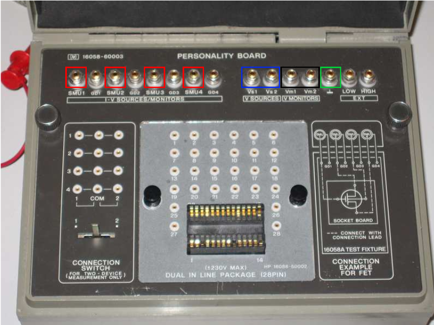

## Procedure

  
**Fig. 1. HP 16058 test fixture**

  
**Steps to perform the real measurement in HP 4145B Semiconductor Parameter Analyzer**  

**Preparation:** 
1.  Ensure the HP 4145B is properly connected to a power source and turned on.
2.  Connect the NPN transistor to the HP 4145B test fixture, ensuring correct placement of the emitter, base, and collector terminals.

**Setup on HP 4145B:** 
1.  Press the SETUP key to begin configuring the instrument.
2.  Select Device Type and set it to NPN Transistor.

**Configure Measurement Settings:**  
  
Base Current ($$I_B$$) Settings:  
*   Press the SOURCE SET key.
*   Select the source for the base current (SMU1, for example).
*   Set the Start Value of the base current (e.g., 10 µA).
*   Set the Stop Value of the base current (e.g., 100 µA).
*   Set the Step Value of the base current (e.g., 10 µA).

Collector-Emitter Voltage ($$V_{CE}$$) Settings: 
*   Press the SOURCE SET key again.
*   Select the source for the collector-emitter voltage (SMU2, for example).
*   Set the Start Value of the collector-emitter voltage (e.g., 0 V).
*   Set the Stop Value of the collector-emitter voltage (e.g., 10 V).
*   Set the Step Value of the collector-emitter voltage (e.g., 0.5 V).
  
  

**Measurement Settings:**
1.  Press the MEAS SET key.
2.  Select the measurement for the collector current (SMU3, for example).
3.  Ensure the compliance settings are correctly configured to protect the transistor from excessive current or voltage.

**Running the Measurement:**
1.  Press the GRAPH key to enter the graphical measurement mode.
2.  Select the X-axis to be VCE and the Y-axis to be IC.
3.  Press the START key to begin the measurement process.

**Observation and Analysis:**
1.  The HP 4145B will display the output characteristics curves on the screen.
2.  Each curve corresponds to a different base current (IB) value.
3.  Observe the family of curves which show how the collector current (IC) changes with varying collector-emitter voltage (VCE) for different base currents (IB).

**Data Collection:**
1.  Save the measurement data if needed for further analysis.
2.  You can also print the graphs or transfer the data to a computer for detailed examination.

**Cleanup:**
1.  Turn off the HP 4145B and disconnect the NPN transistor.
2.  Ensure all connections are safely removed and the workspace is clean.

**Additional Tips:**
1.  Safety: Always ensure the compliance limits are set within safe operating ranges for the NPN transistor to prevent damage.
2.  Calibration: Periodically calibrate the HP 4145B to maintain measurement accuracy.
3.  Documentation: Keep a detailed record of the measurement settings and results for reproducibility and analysis.

By following these steps, you should be able to successfully obtain and analyze the output characteristics of an NPN transistor using the HP 4145B Semiconductor Parameter Analyzer.
