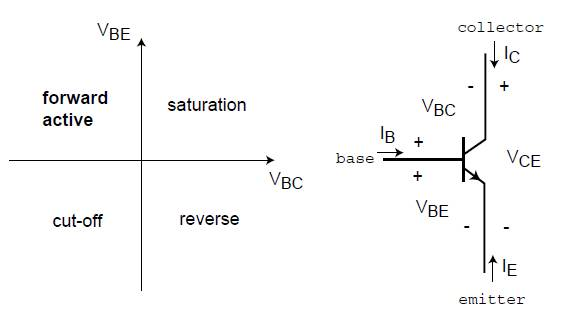
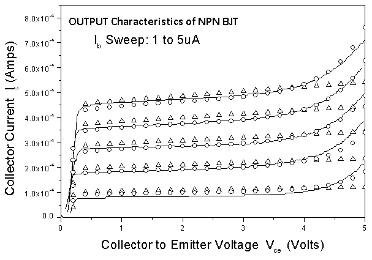
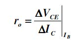
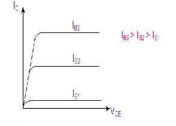
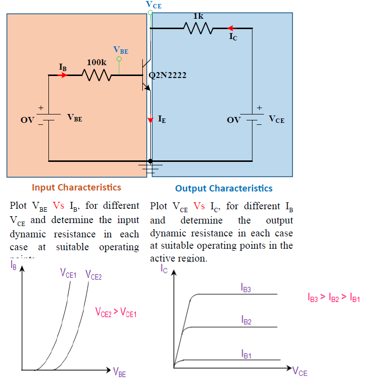
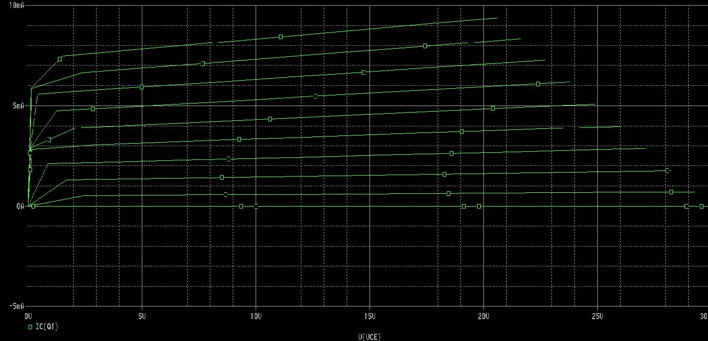

## Theory
**Introduction:**  
Bipolar junction transistor (BJT) is one of the most widely used semiconductor devices in manufacturing integrated circuits and electronic components. Because of its superior speed performance, such a device has found wide applications in high-speed switching and digital electronics systems. The conventions for terminal naming, voltage and current notations, and the various regimes of operation for an npn BJT are all shown in Figure 1:  
  

**Fig. 1.Circuit diagram**

  
Important note: For all measurements, hold $$V_{BE}$$ between 0 and 0.9 V, and $$V_{CE}$$ between 0 and 5 V.  
  
In this experiment, you will characterize the current-voltage characteristics of an npn bipolar junction transistor (BJT) using the IIT-Kharagpur Lab-on-Demand. This experiment involves measurement of current-voltage characteristics (Output characteristics). Typical output characteristics are shown in Figure 2.  

**Fig. 2. Circuit diagram**

  
**About BJT**  
A Bipolar Junction Transistor, or BJT is a three terminal device having two PNjunctions connected together in series. Each terminal is given a name to identify it and these are known as the Emitter (E), Base (B) and Collector (C). There are two basic types of bipolar transistor construction, NPN and PNP, which basically describes the physical arrangement of the P-type and N-type semiconductor materials from which they are made. Bipolar Transistors are "CURRENT" Amplifying or current regulating devices that control the amount of current flowing through them in proportion to the amount of biasing current applied to their base terminal. The principle of operation of the two transistor types NPN and PNP, is exactly the same the only difference being in the biasing (base current) and the polarity of the power supply for each type.  
  
**Transistor Configurations and Characteristics:**  
There are three possible configurations possible when a transistor is connected in a circuit: (a) Common base, (b) Common emitter (c) Common collector. We will be focusing on the Common emitter configurations in this experiment. The behaviour of a transistor can be represented by d.c. current-voltage (I-V) curves, called the static characteristic curves of the device. The three important characteristics of a transistor are: (i) Input characteristics, (ii) Output characteristics and (iii) Transfer Characteristics. These characteristics give information about various transistor parameters, e.g. input and out dynamic resistance, current amplification PNP NPN factors, etc.  
  
**Common Emitter Transistor Output Characteristics**  
The variation of the collector current $$I_C$$ with the collector-emitter voltage $$V_{CE}$$ is called the output characteristic. The plot of $$I_C$$ versus $$V_{CE}$$ for different fixed values of IB gives one output characteristic. Since the collector current changes with the base current, there will be different output characteristics corresponding to different values of IB. Output Dynamic Resistance (ro): This is defined as the ratio of change in collector-emitter voltage (Δ $$V_{CE}$$) to the change in collector current (Δ $$I_C$$) at a constant base current IB. The high magnitude of the output resistance (of the order of 100 kW) is due to the reverse biased state of this diode.  
  

  

 
**Fig. 3. characteristic graph**

  
**Output characteristics:**  
Plot $$V_{CE}$$ Vs $$I_C$$, for different IB and determine the output dynamic resistance in each case at suitable operating points in the active region.  
  

**Fig. 4. comparision**

  
**RESULT**  
Thus the input and output characteristics of an NPN transistor in Common Emitter mode is studied using pspice simulation. Input characteristics: $$V_{BE}$$ Vs $$I_B$$, for different $$V_{CE}$$ and determine the input dynamic resistance in each case at suitable operating points. Output characteristics: $$V_{CE}$$ Vs $$I_C$$, for different IB and determine the output dynamic resistance in each case at suitable operating points in the active region.  
  
**Secondary Sweep :**  

**Fig. 5. instrument output graph**
     
 
